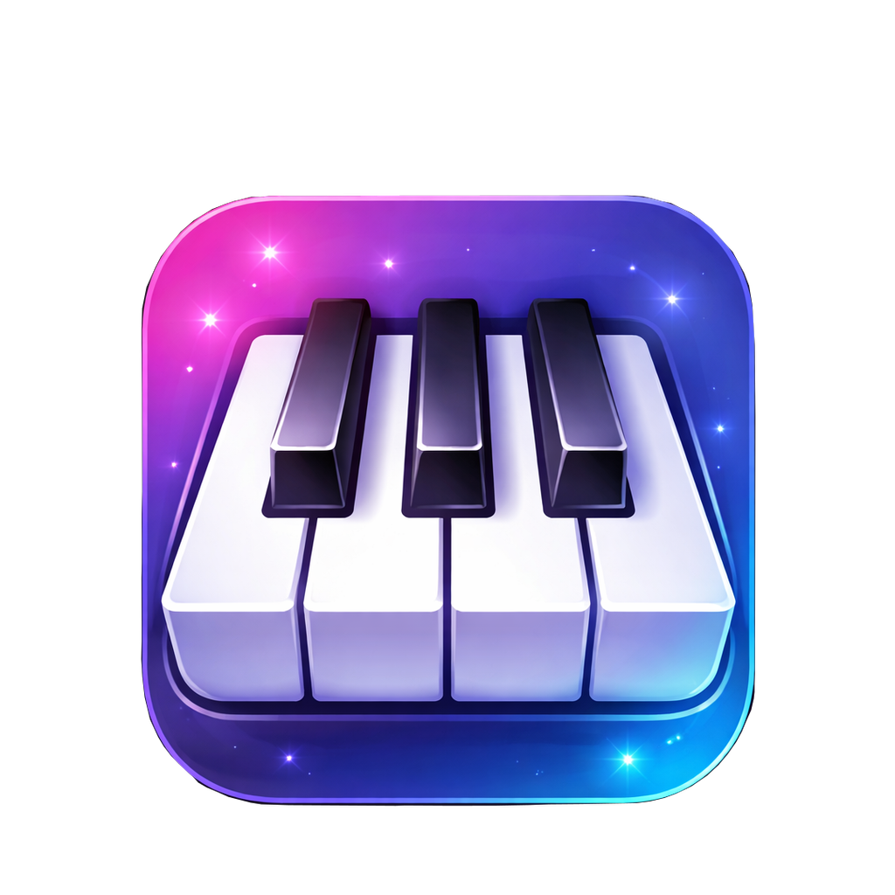

<p align="center">
  
</p>

<h1 align="center">Minimal Piano 🎹</h1>

<p align="center">
  A beautiful, responsive, and minimalistic piano app built with React Native & Expo.
  <br />
  Play, record, and export — right from your phone, tablet, or browser.
</p>

<p align="center">
  <a href="https://github.com/Ayush2006128/minimal-piano/stargazers">
    
  </a>
  <a href="https://github.com/Ayush2006128/minimal-piano/network/members">
    
  </a>
  <a href="https://github.com/Ayush2006128/minimal-piano/issues">
    
  </a>
  <a href="LICENSE">
    
  </a>
  <a href="https://github.com/sponsors/Ayush2006128">
    
  </a>
</p>

---

## ✨ Features

| Feature | Description |
|---|---|
| 🎵 **Real-time Synthesis** | Low-latency audio playback powered by `react-native-audio-api` — no sample files needed. |
| 🔎 **Zoom Controls** | Pinch or tap to zoom in/out of the keyboard for comfortable play on any screen size. |
| 🎼 **Octave Shifting** | Shift the base octave up or down to access the full 88-key range. |
| 🎙️ **Record & Export** | Record your performance and export it as a `.wav` file to share with friends. |
| 📱 **Cross-Platform** | Runs natively on **Android**, **iOS**, and the **Web** from a single codebase. |
| 🎨 **Beautiful UI** | Elegant dark theme with smooth `react-native-reanimated` animations on every key press. |

## 🚀 Quick Start

### Prerequisites

- [Node.js](https://nodejs.org/) v18+
- [npm](https://www.npmjs.com/) or [yarn](https://yarnpkg.com/)
- [Expo CLI](https://docs.expo.dev/get-started/installation/)

### Installation

```bash
# Clone the repository
git clone https://github.com/Ayush2006128/minimal-piano.git
cd minimal-piano

# Install dependencies
npm install
```

### Running the App

```bash
# Start the Expo dev server
npx expo start
```

Then press:
- **`a`** — open on Android emulator / device
- **`i`** — open on iOS simulator
- **`w`** — open in your web browser

> [!IMPORTANT]
> This app uses native modules (e.g. `react-native-audio-api`) and **will not work in Expo Go**. You'll need to create a [development build](https://docs.expo.dev/develop/development-builds/introduction/) to run it on a physical device or emulator.

## 🛠️ Tech Stack

| Technology | Purpose |
|---|---|
| [React Native](https://reactnative.dev/) | Cross-platform mobile framework |
| [Expo](https://expo.dev/) (SDK 54) | Managed workflow & build tooling |
| [Expo Router](https://docs.expo.dev/router/introduction/) | File-based routing |
| [React Native Audio API](https://github.com/react-native-audio-api/react-native-audio-api) | Real-time audio synthesis |
| [React Native Reanimated](https://docs.swmansion.com/react-native-reanimated/) | 60 fps key-press animations |
| [React Native Gesture Handler](https://docs.swmansion.com/react-native-gesture-handler/) | Touch & gesture handling |

## 📜 Available Scripts

| Script | Description |
|---|---|
| `npm start` | Start the Expo dev server |
| `npm run android` | Launch on Android |
| `npm run ios` | Launch on iOS simulator |
| `npm run web` | Launch in your browser |
| `npm run lint` | Run ESLint |
| `npm test` | Run Jest tests |

## 🤝 Contributing

Contributions, issues, and feature requests are welcome!

1. **Fork** the repo
2. **Create** your feature branch — `git checkout -b feat/amazing-feature`
3. **Commit** your changes — `git commit -m "feat: add amazing feature"`
4. **Push** to the branch — `git push origin feat/amazing-feature`
5. **Open** a Pull Request

## 💖 Support the Project

If you find Minimal Piano useful, consider giving it a **⭐ star** on GitHub — it means a lot!

You can also support development directly:

<a href="https://github.com/sponsors/Ayush2006128">
  
</a>

## 📄 License

This project is licensed under the **MIT License** — see the [LICENSE](LICENSE) file for details.

---

<p align="center">
  Made with ❤️ by <a href="https://github.com/Ayush2006128">Ayush Muley</a>
</p>